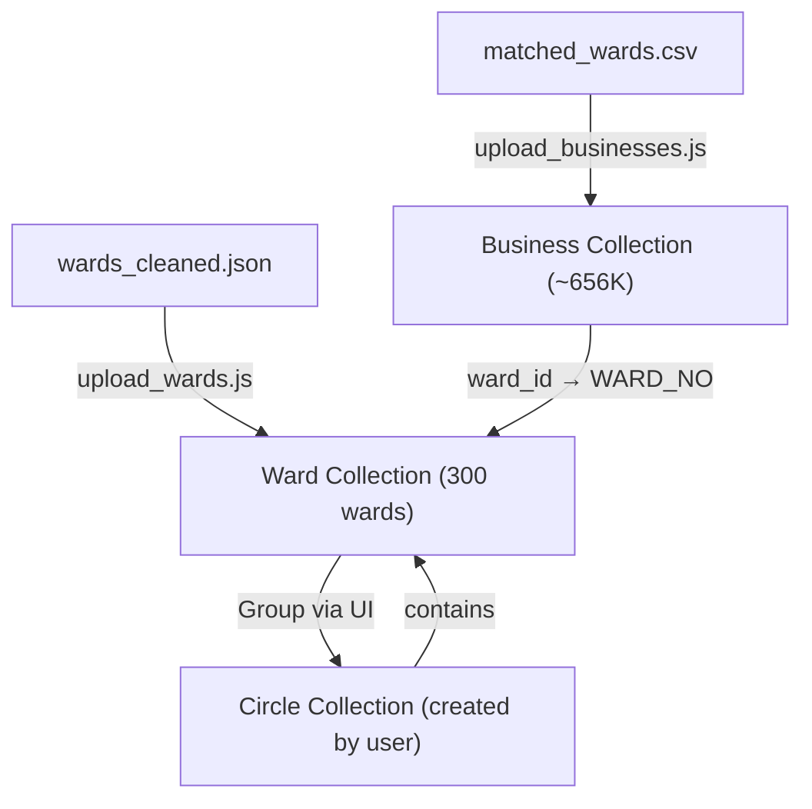

# Fresh Start: Ward-First Architecture

## New Data Flow



## What Changed

| Component | Before | After |
|-----------|--------|-------|
| **Ward** | Required `CIRCLE_NO` | `CIRCLE_NO` is optional metadata |
| **Circle** | Pre-loaded from GeoJSON | Created by grouping wards in the UI |
| **Business** | Linked via lat/lng geospatial queries | Linked via `ward_id` from CSV |
| **MapComponent** | Mapbox (commented out) | MapLibre with OSM tiles (free, working) |
| **Circle.js** | Commented out | Working list page with CRUD |
| **Dashboard** | Empty placeholder | Live stats with navigation |

## Files Modified

### Backend
- [Ward.js](file:///c:/Users/91970/Downloads/stateGst/gst-poc/backend/models/Ward.js) — `CIRCLE_NO` now optional
- [Circle.js](file:///c:/Users/91970/Downloads/stateGst/gst-poc/backend/models/Circle.js) — Added `wards[]` array as source of truth
- [v2.js](file:///c:/Users/91970/Downloads/stateGst/gst-poc/backend/routes/v2.js) — Rewritten for ward-first queries

### Backend Scripts (new)
- [upload_wards.js](file:///c:/Users/91970/Downloads/stateGst/gst-poc/backend/upload_wards.js) — Loads `wards_cleaned.json` → MongoDB
- [upload_businesses.js](file:///c:/Users/91970/Downloads/stateGst/gst-poc/backend/upload_businesses.js) — Loads `matched_wards.csv` → MongoDB (links via `ward_id`)

### Frontend
- [Dashboard.js](file:///c:/Users/91970/Downloads/stateGst/gst-poc/map-selector/src/pages/Dashboard.js) — Live stats + navigation
- [Circle.js](file:///c:/Users/91970/Downloads/stateGst/gst-poc/map-selector/src/pages/Circle.js) — Circle list with search, delete
- [MapComponent.js](file:///c:/Users/91970/Downloads/stateGst/gst-poc/map-selector/src/pages/MapComponent.js) — MapLibre ward visualization

## Next Steps (Run These Commands)

> [!IMPORTANT]
> You must drop the database first (as you mentioned), then run these in order.

### Step 1: Drop the database
Do this manually via MongoDB Atlas or Compass.

### Step 2: Upload wards
```powershell
cd c:\Users\91970\Downloads\stateGst\gst-poc\backend
node upload_wards.js
```
Expected: ~300 wards inserted.

### Step 3: Upload businesses
```powershell
node upload_businesses.js
```
Expected: ~656,000 businesses inserted, linked to wards via `ward_id`.

### Step 4: Restart backend & frontend
```powershell
# Terminal 1 — Backend
cd c:\Users\91970\Downloads\stateGst\gst-poc\backend
npm start

# Terminal 2 — Frontend
cd c:\Users\91970\Downloads\stateGst\gst-poc\map-selector
npm start
```

### Step 5: Create circles via the UI
1. Log in → Dashboard shows ward/business stats
2. Navigate to **Circle Management** (`/circle-management`)
3. Click wards on the map → fill in Circle Name & Number → "Group Into Circle"
4. View created circles on the **Circles** page (`/circles`)
